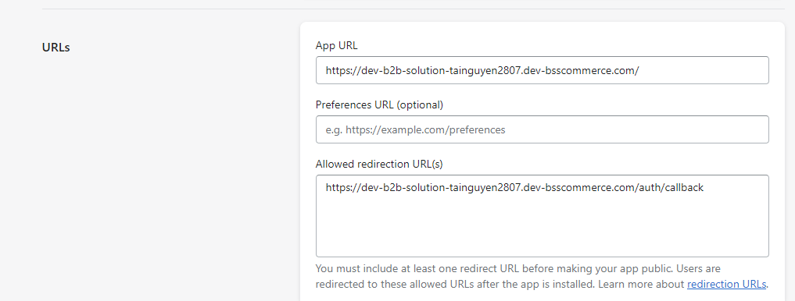
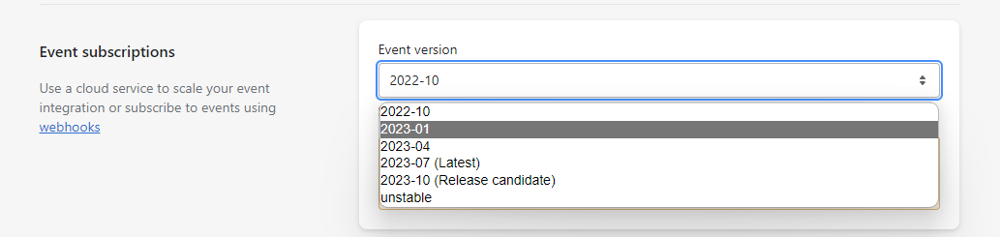
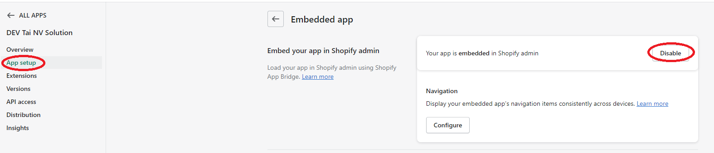
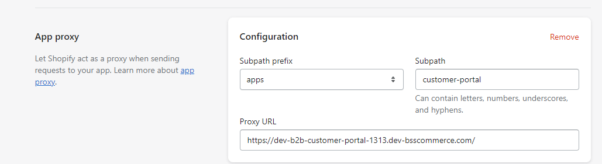
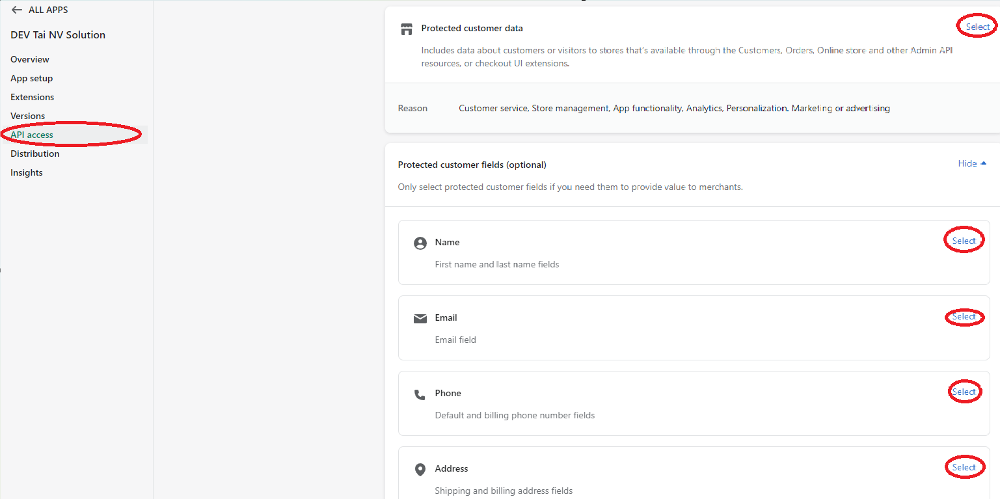
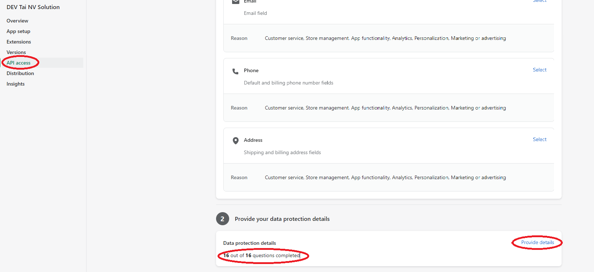

## 1. Setup WSL and VSCode (skip this if you are using MacOS)
Follow this tutorial [link](https://learn.microsoft.com/en-us/windows/wsl/install) to setup WSL

Quick setup:
- Open PowerShell as Administrator and run:
```bash
wsl.exe --update
wsl.exe --install -d Ubuntu-22.04
```

- Install VSCode and Remote WSL extension

If you need help, contact devops team to assist you

## 2. Clone project 

2.1. Setup SSH key for Bitbucket

Run this script, enter your email and put the public key to your bitbucket account
    
```bash
cat <<EOF > setup_ssh_key.sh
if [ -f ~/.ssh/gitlab ]; then
  echo "SSH key is already exist"
  exit 0
fi

mkdir -p ~/.ssh
read -p "Enter your email address: " EMAIL_ADDRESS
ssh-keygen -t ed25519 -b 4096 -C $EMAIL_ADDRESS -f ~/.ssh/gitlab  -q -N ""
SSH_AGENT_INFO=$(ssh-agent -s)
eval "$SSH_AGENT_INFO"
ssh-add ~/.ssh/gitlab

if [ ! -f ~/.ssh/config ]; then
  touch ~/.ssh/config
fi

cat <<EOF2 >> ~/.ssh/config
Host sbc-gitlab.bsscommerce.com
  AddKeysToAgent yes
  IdentityFile ~/.ssh/gitlab
EOF2

echo "Please copy the following public key to your bitbucket account"
tput setaf 6
cat ~/.ssh/gitlab.pub
tput sgr0
EOF
bash setup_ssh_key.sh
```

2.2. Clone project

```bash
mkdir -p ~/BSS
git clone git@bitbucket.org:bsssupport/shopify-dev-setup-pack.git ~/BSS/shopify-dev-setup-pack
```
2.3 Config git user

```bash
git config --global user.name "Your Name"
git config --global user.email "Your Company Email"
```

## 3. Setup environment 
3.1. Run setup dev environment script

```bash
cd ~/BSS/shopify-dev-setup-pack
sudo bash local_setup.sh init
```

Options:
- `-f`: Force to reinit dev environment

Type to change value of the following variables:

- `DEV_SITE`: Change this to a unique number id | Ex: tuannm123
- `USERNAME`: Change this to your username | Ex: tuannm

Quit the terminal session and open again

```bash
logout
exit
```

## 4. Setup development project
Apps which are supported by this script:

- B2B Solution: `b2b`
- B2B Customer Portal: `bcp`
- Login Access Management: `login`
- Bloop 2.0: `bloop`
- Product Labels: `label`
- Product Options: `option`
- Store Locator: `locator`
- Mida Recording: `mida`
- Subscription & Membership: `sub`
- Shopify CMS Admin Management: `cms-admin`

Steps to setup development project:

4.1.  Run setup script

```bash
cd ~/BSS/shopify-dev-setup-pack
sudo bash local_setup.sh install <app-name> 
```

Example
```bash
sudo bash local_setup.sh install b2b # Install B2B Solution

sudo bash local_setup.sh install bcp # Install B2B Customer Portal
```

After finish setup, exit terminal session and open again, then you can access the development source code stored at `$HOME/BSS/` 

_Notes: In case you want to update environment variables, you can run the following command_

```bash
<app name> setup_env  # Ex: b2b setup env
<app name> restart    # Ex: b2b restart

```

## 5. Using app script
Usage

To use the app script, execute it using the following command:

```bash
<app name> <command>  # Ex: b2b start
```

- `install`: Install the development project (automatically setup environment variables, install dependencies, start the development app)
- `install_packages`: Install npm packages
- `setup_env`: Setup and update environment variables
- `restart`: Restart app processes (api, cms, ...)
- `start`: Start app processes 
- `stop`: Stop app processes 
- `clean_process`: Delete app processes
- `clean`: Delete app source code and processes
- `pull`: Pull latest source code from origin master 
- `branch`: Check current branch for all repo
- `commit`: Commit code for all repo
- `push`: Push code for all repo
- `checkout`: Checkout branch for all repo
- `domain`: Show list domain
- `update_db`: Run migrate database for all microservices 
- `update`: Auto pull code, install packages, run migrate database for all microservices


Options:
- `-p`: Prompt to recreate script env


## 6. Post installing

6.1. Install fonts

Install Fira Code Nerd Font Windows: Download and install [FiraCode Nerd Font](https://github.com/ryanoasis/nerd-fonts/raw/master/patched-fonts/FiraCode/Regular/FiraCodeNerdFont-Regular.ttf) and set your IDE (VSCode, Webstorm, ...) and Terminal font to `FiraCode Nerd Font`

Install Fira Code Nerd Font Linux: Font is already installed by running the script, so you just need to set your IDE (VSCode, Webstorm, ...) and Terminal font to `FiraCode Nerd Font`

6.2. Configure Terminal

Open wsl or linux terminal, type in:
```bash
p10k configure
```

## 7. Configure app on Shopify Partner (For new app only)

Go to `Apps` section on `Shopify Partner`, find your app and go to `App setup` section
- Replace `App URL` match your app domain  (run `<appname> show_domain` to show list domain or check your domain name in app folder env files [Eg: BSS/<app_folder>/cms.env] or shopify-dev-setup-pack/domain_list) | Ex: https://dev-b2b-solution-n.dev-bsscommerce.com

- Replace `Allowed redirection URL(s)`: | Ex: https://dev-b2b-solution-n.dev-bsscommerce.com/auth/callback



- Change `Event subscriptions` Event Version to match your API Version



- Disable Embedded setting at `Embedded app` app section if you are installing standalone app (b2b, bcp, login, mida, bloop, subcription)



- Configure `APP Proxy` if needed (for app B2B Customer Portal, Login Access Management) 



Go to `API Access` section -> `Protected customer data access` -> Click on `Manage`

- At the first section `Select your data use and reasons`, there are 5 subsection, click Show -> Select on every section, then tick on every tickbox to allow permission (except `Other`)



- At the second section `Provide your data protection details`, click on `Provide details` -> Tick yes on every radio button



- Click save to save all changes


